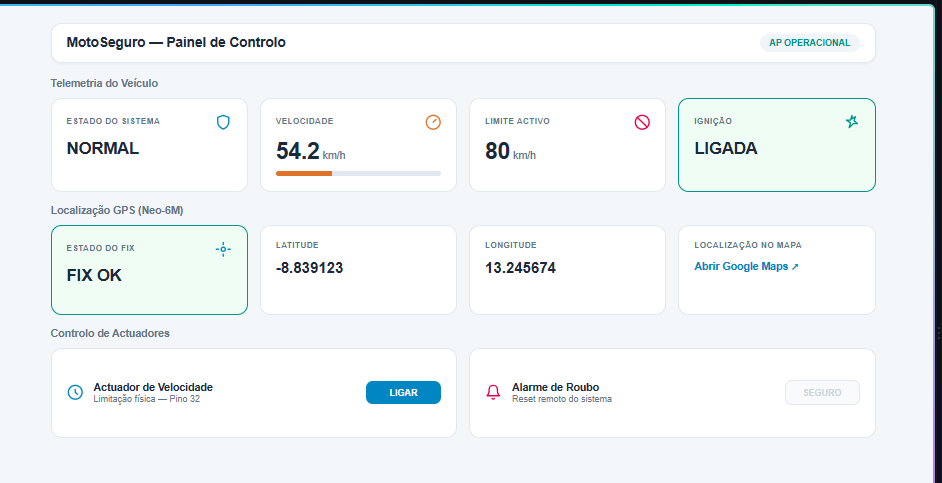

# MotoSeguro

<p align="center">
  
</p>

MotoSeguro é um projeto open source de segurança veicular para motocicletas, desenvolvido em MicroPython para ESP32. O sistema combina monitorização de velocidade, detecção de ignição, GPS, comunicação GSM e um painel web local para permitir controlo remoto e proteção contra roubo.

O objetivo do projeto é oferecer uma solução acessível, educativa e funcional para monitorizar o estado de uma moto e agir automaticamente quando há sinais de roubo, excesso de velocidade ou necessidade de controlo remoto.

## Visão geral

Este projeto inclui:

- Monitorização de velocidade via sensor Hall
- Detecção de ignição do veículo
- Leitura de coordenadas GPS
- Envio de alertas por SMS
- Receção de comandos por SMS
- Painel web local com dashboard em HTML/JS
- Actuador de velocidade para limitação física
- Sistema de alerta com LED e buzzer
- Modo de segurança em caso de roubo

---

## Funcionalidades principais

### 1. Segurança contra roubo

Se a ignição estiver desligada e a velocidade ultrapassar um valor mínimo, o sistema considera uma situação de roubo e entra em modo de alarme.

Quando isso acontece:

- dispara estado `ROUBO`
- desliga o atuador
- ativa LED em intermitência
- ativa buzzer em modo de alerta
- envia SMS de aviso ao proprietário
- pode receber comando remoto de reset

### 2. Limitação de velocidade

O sistema mede a velocidade e, caso exceda o limite configurado, ativa o atuador para limitar fisicamente a velocidade do veículo.

Estados do sistema:

- `NORMAL`: operação normal
- `LIMITANDO`: velocidade acima do limite
- `ROUBO`: situação de roubo detectada

### 3. GPS e localização

O módulo GPS fornece coordenadas em formato NMEA. O sistema extrai latitude, longitude e velocidade do GPS para montar um link do Google Maps e enviar no alerta.

### 4. Comunicação GSM

O módulo GSM/SIM permite:

- enviar SMS de alarme
- responder a comandos por SMS
- consultar o estado do sistema
- resetar o estado de roubo remotamente

### 5. Dashboard local via Wi-Fi

O ESP32 atua como ponto de acesso Wi-Fi e disponibiliza uma interface web local para leitura do estado do sistema e controlo simples.

A dashboard mostra:

- velocidade atual
- limite ativo
- estado do sistema
- ignição
- fix GPS
- latitude e longitude
- estado do atuador
- botão para reset

---

## Hardware necessário

### Módulos e componentes

- ESP32 DevKit
- Módulo GPS Neo-6M ou equivalente
- Módulo GSM SIM900/SIM800 (ou modelo compatível)
- Sensor Hall para velocidade
- Sensor de ignição (entrada digital)
- LED 3V/5V
- Buzzer ativo/passivo
- Botão para reset manual
- Relé/atuador para limitação da velocidade
- Fonte de alimentação estável para o sistema

### Pinagem utilizada no projeto

| Função | Pino ESP32 |
| --- | --- |
| GPS RX | GPIO 16 |
| GPS TX | GPIO 17 |
| GSM RX | GPIO 26 |
| GSM TX | GPIO 27 |
| Sensor Hall | GPIO 34 |
| Ignição | GPIO 22 |
| Atuador | GPIO 32 |
| LED | GPIO 33 |
| Buzzer | GPIO 25 |
| Botão | GPIO 14 |

> Atenção: a pinagem pode variar conforme o módulo e o hardware utilizado. Verifique sempre a tensão e a compatibilidade dos sinais antes de conectar os módulos.

---

## Estrutura do projeto

```text
motoseguro/
├── main.py
├── README.md
└── (opcional) outros ficheiros de configuração ou libs
```

O projeto principal encontra-se em `main.py` e contém todo o código MicroPython do sistema.

---

## Requisitos de software

- MicroPython instalado no ESP32
- IDE ou ferramenta para upload de ficheiros (`mpfshell`, esptool, Thonny, VS Code com extensão adequada, etc.)
- Serial/USB em ambiente de desenvolvimento
- Acesso ao módulo GSM e GPS

---

## Instalação e configuração

### 1. Instalar MicroPython no ESP32

Carregue a imagem MicroPython correta para o modelo do ESP32 que estiver a usar.

### 2. Copiar o código para o dispositivo

Transfira o ficheiro `main.py` para o ESP32.

### 3. Ajustar configurações do sistema

No início do ficheiro, existem constantes que devem ser ajustadas ao seu caso real:

```python
NUMERO_PROPRIETARIO = "+244xxxxxxxxx"
LIMITE_VEL_PADRAO = 80
MARGEM_KMH = 5
SMS_INTERVALO_S = 150
AP_SSID, AP_SENHA = "MotoSeguro", "motoseguro"
```

Ajuste:

- telefone do proprietário para receber SMS
- limite padrão de velocidade
- rede Wi-Fi do ponto de acesso
- intervalo de envio de SMS

### 4. Verificar as conexões de hardware

Antes de ligar a alimentação definitiva:

- confirme a polaridade dos módulos
- verifique o nível lógico dos pinos
- confirme que o GSM e o GPS estão ligados ao UART correto
- teste o sensor Hall e as entradas digitais

### 5. Executar o sistema

Após o upload:

1. ligue o ESP32
2. aguarde a inicialização
3. conecte-se ao ponto de acesso `MotoSeguro`
4. abra no navegador a URL indicada no terminal/ip do módulo

A dashboard estará disponível em algo como:

```text
http://<IP_DO_ESP32>/
```

---

## Painel web

Ao ligar o ESP32, o módulo cria um hotspot Wi-Fi com o nome configurado.

O dashboard permite:

- visualizar estado do sistema em tempo real
- consultar estado do GPS
- ver velocidade e limite
- verificar se a ignição está ligada
- acionar o atuador manualmente
- confirmar alarme de roubo

### Exemplos de endpoints

- `/` : página principal do dashboard
- `/api/data` : JSON com telemetria
- `/comando?cmd=atuador&estado=1` : liga atuador
- `/comando?cmd=reset` : reseta o sistema em caso de roubo

---

## Comandos por SMS

O sistema aceita os seguintes comandos (em texto):

### `LIMIT:XX`

Define um novo limite de velocidade.

Exemplos:

```text
LIMIT:60
LIMIT:90
LIMIT:0
```

- `LIMIT:0` repõe o limite padrão

### `STATUS`

Solicita o estado atual do sistema. O módulo responde com:

- estado atual
- velocidade
- limite
- coordenadas GPS

### `RESET`

Se o sistema estiver em modo `ROUBO`, o comando cancela o estado de roubo.

---

## Lógica de funcionamento

### Modo normal

- ignição ligada
- sistema observa velocidade e limites
- atuador desligado quando tudo está dentro do normal

### Modo limitando

- ultrapassou limite configurado
- atuador é ativado
- sistema mantém alerta visual no painel

### Modo roubo

- ignição desligada
- veículo em movimento
- sistema entra em alarme
- envio de SMS ao proprietário
- buzzer e LED ficam ativos

---

## Limitações e considerações importantes

- A precisão do GPS depende da qualidade do sinal e da posição do módulo
- O módulo GSM precisa de antena apropriada e boa cobertura de rede
- O sistema foi pensado para protótipo/hardware experimental e pode exigir ajustes finos para produção
- O uso do atuador deve respeitar as especificações do veículo e as normas de segurança
- Sempre teste o projeto em bancada antes de instalar num veículo real

---

## Segurança e boas práticas

- utilize alimentação estável e protegida
- evite interferências de ruído elétrico na linha do GSM/GPS
- teste todos os sensores antes do uso em estrada
- mantenha o sistema isolado e protegido em invólucro adequado
- nunca implemente ligações de potência de alta corrente sem proteção adequada

---

## Possíveis melhorias futuras

- suporte a conexão MQTT/IoT
- gravação de histórico de eventos em memória ou cartão SD
- envio de localização via HTTP para backend
- integração com app móvel
- melhor tratamento de erros e reconexão GSM
- alertas por e-mail ou Telegram
- autenticação para dashboard web
- interface mais avançada com gráficos de velocidade e histórico

---

## Contribuição

Contribuições são bem-vindas.

Se quiser participar:

1. faça um fork do projeto
2. crie uma branch para a sua funcionalidade
3. teste e valide a alteração
4. abra um pull request com descrição clara

Sugestões úteis:

- melhoria na pinagem
- ajustes no algoritmo de velocidade
- robustez no processamento de SMS
- suporte a mais módulos GSM/GPS
- otimização do dashboard

---

## Licença

Este projeto é open source e pode ser publicado sob uma licença aberta, como MIT. Recomendamos adicionar um ficheiro `LICENSE` ao repositório antes de o publicar oficialmente.

---

## Autor / contexto

Projeto desenvolvido para demonstração prática de automação e segurança veicular com ESP32, MicroPython, GPS, GSM e lógica de controlo em tempo real.

Se o projeto for usado ou adaptado, o ideal é manter o código livre e documentado, promovendo colaboração e melhoria contínua da solução.

---

## Contacto e suporte

Este repositório está pensado para uso educacional e experimental. Qualquer melhoria, correção ou adaptação pode ser partilhada via pull request ou por comunicação direta com o autor do projeto.

---

## Resumo rápido

MotoSeguro é um sistema embarcado para segurança e monitorização de motocicletas, com foco em:

- prevenção de roubo
- controlo de velocidade
- telemetria em tempo real
- gestão remota por SMS e dashboard local

Se pretender, também posso criar uma versão mais profissional do README com:

- badges (status, licença, linguagem, hardware)
- secção de arquitetura em diagramas
- instruções de instalação mais detalhadas para ESP32 + GSM + GPS
- versão para GitHub pronta para publicar


## Preview


